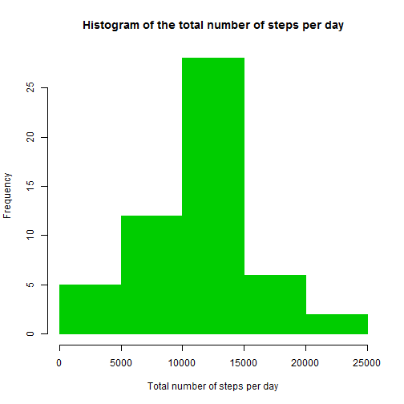
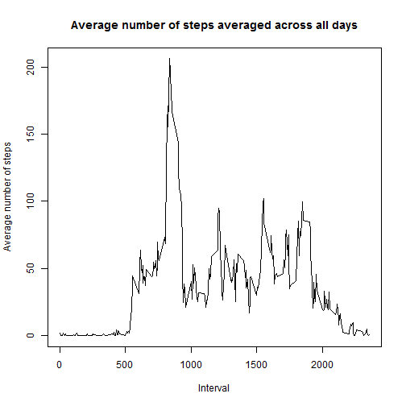
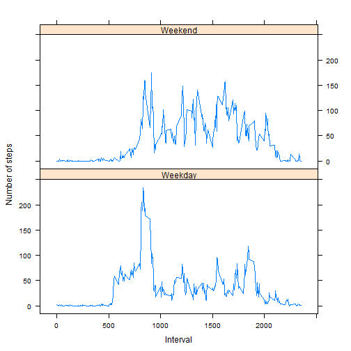

## Loading and preprocessing the data
Load, unzip, read and process the activity data file


```r
activityData <- read.csv(unz("activity.zip", "activity.csv"))

clean_activityData <- na.omit(activityData)
```


## What is mean total number of steps taken per day?

1. Calculate the total number of steps taken per day


```r
library(data.table)
```

```
## Warning: package 'data.table' was built under R version 3.2.3
```

```
## data.table 1.9.6  For help type ?data.table or https://github.com/Rdatatable/data.table/wiki
## The fastest way to learn (by data.table authors): https://www.datacamp.com/courses/data-analysis-the-data-table-way
```

```r
dt <- data.table(clean_activityData)
df <- as.data.frame(dt[,list(total = sum(steps)), by =c("date")])
```

2. If you do not understand the difference between a histogram and a barplot, research the difference between them. Make a histogram of the total number of steps taken each day


```r
hist(df$total, col=3, main="Histogram of the total number of steps per day", 
     xlab="Total number of steps per day", border = 3)
```

 

3. Calculate and report the mean and median of the total number of steps taken per day


```r
meanStep <- mean(df$total)
medianStep <- median(df$total)
```
The mean is 1.0766189 &times; 10<sup>4</sup> and the median is 10765.

## What is the average daily activity pattern?

1. Make a time series plot (i.e. type = "l") of the 5-minute interval (x-axis) and the average number of steps taken, averaged across all days (y-axis)


```r
interval_steps1 <- aggregate(steps ~ interval, clean_activityData, mean)
```


```r
plot(interval_steps1$interval, interval_steps1$steps, type='l', col=1, 
     main="Average number of steps averaged across all days", xlab="Interval", 
     ylab="Average number of steps")
```

 


2. Which 5-minute interval, on average across all the days in the dataset,contains the maximum number of steps?    

```r
max_row_id <- which.max(interval_steps1$steps)    
interval_steps1 [max_row_id, ]    
```

```
##     interval    steps
## 104      835 206.1698
```

The interval 8.35 AM has the maximum number of steps @ 206.

## Imputing missing values

1. Calculate and report the total number of missing values in the dataset (i.e. the total number of rows with NAs)


```r
data_NA <- activityData[!complete.cases(activityData),]
Total_rows <- nrow(data_NA)
```
The total number of missing rows with NAs are 2304


2. Devise a strategy for filling in all of the missing values in the dataset. The strategy does not need to be sophisticated. For example, you could use the mean/median for that day, or the mean for that 5-minute interval, etc.
The mean for the 5 minute interval is replaced for all NA assigned to interval_steps1. The records are looped through and if the value is NA then corresponding value of interval is considered as referred in above steps

3. Create a new dataset that is equal to the original dataset but with the missing data filled in.


```r
for (i in 1:nrow(df)){
  if (is.na(activityData$steps[i])){
    interval_val <- activityData$interval[i]
    row_id <- which(interval_steps1$interval == interval_val)
    steps_val <- interval_steps1$steps[row_id]
    activityData$steps[i] <- steps_val
  }
}
```

Aggregate steps as per date to get total number of steps in a day

```r
inserted <- aggregate(steps ~ date, activityData, sum)
```

4. Make a histogram of the total number of steps taken each day and Calculate and report the mean and median total number of steps taken per day. Do these values differ from the estimates from the first part of the assignment? What is the impact of imputing missing data on the estimates of the total
daily number of steps?


```r
hist(inserted$steps, col=3, border = 3, main="(Imputed) Histogram of total number of steps per day", xlab="Total number of steps in a day")
```

 

```r
mean2 <- mean(inserted$steps)
median2 <- median(inserted$steps)
```
Mean with imputed values is 1.0567294 &times; 10<sup>4</sup> or 10567 whereas previously it was 1.06825 &times; 10<sup>4</sup> or 10766. The median with imputed values is 1.0682 Ã<U+0097> 104 or 10682 whereas it was 10765 before. Therefore the mean is reduced by 199 there is a difference of 83 to the median.

## Are there differences in activity patterns between weekdays and weekends?
1. Create a new factor variable in the dataset with two levels - "weekday" and "weekend" indicating whether a given date is a weekday or weekend day


```r
day <- weekdays(as.Date(activityData$date))
daylevel <- vector()
for (i in 1:nrow(activityData)) {
    if (day[i] == "Saturday") {
        daylevel[i] <- "Weekend"
    } else if (day[i] == "Sunday") {
        daylevel[i] <- "Weekend"
    } else {
        daylevel[i] <- "Weekday"
    }
}
activityData$daylevel <- daylevel
activityData$daylevel <- factor(activityData$daylevel)

stepsByDay <- aggregate(steps ~ interval + daylevel, data = activityData, mean)
names(stepsByDay) <- c("interval", "daylevel", "steps")
```

2. Make a panel plot containing a time series plot (i.e. type = "l") of the 5-minute interval (x-axis) and the average number of steps taken, averaged across all weekday days or weekend days (y-axis). The plot should look something like the following, which was creating using simulated data 


```r
library(lattice)

xyplot(steps ~ interval | daylevel, stepsByDay, type = "l", layout = c(1, 2), 
    xlab = "Interval", ylab = "Number of steps")
```

 

